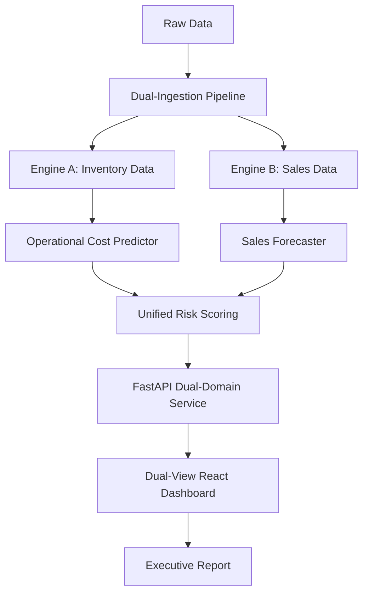

# 📚 Project FORESIGHT: Demand & Inventory Intelligence

This document serves as the comprehensive log of everything accomplished in building the End-to-End Retail Machine Learning System. 

## Overall Workflow

## 1. Project Initialization & Data Ingestion
- **Setup:** Created a dedicated Python virtual environment (`venv`) and installed core dependencies (Pandas, LightGBM, Streamlit, FastAPI, etc.).
- **Dataset:** Automatically downloaded a synthetic 10-million row retail dataset from Kaggle (`sales_transactions.csv`, `sku_master.csv`, `inventory_snapshot.csv`).
- **Calendar Generation:** Since the dataset lacked a calendar, we programmatically generated a `calender.csv` spanning 2022 to 2026, including temporal features like `is_weekend`, `quarter`, and `day_of_week`.

## 2. Feature Engineering (Phase 1)
- **Aggregation:** Ingested the raw 800MB (10M rows) `sales_transactions.csv` and aggregated it down to the daily `Store-SKU` level, resulting in ~8.5 million optimized records.
- **Data Unified:** Merged the aggregated sales data with the calendar dates, SKU master details, and Store master details.
- **Storage:** Saved the engineered dataset as a compressed `daily_sales_features.parquet` file for extremely fast read/write times during ML training.

## 3. Demand Forecasting Model (LightGBM)
- **Algorithm:** Trained a LightGBM Gradient Boosting Regressor to predict the future daily `quantity` sold for each product.
- **Time-Split:** Trained on 2025 data (pre-November) and validated on November/December 2025 data to prevent time leakage.
- **Results:** Achieved an RMSE of ~1.58, representing a massive **42% improvement** over a naive baseline moving average.
- **Artifact:** The trained model was serialized and saved to `models/lgbm_forecaster.pkl`.

## 4. AI Risk Scoring Engine
- **Horizon:** Built a script that generates a 14-day future lookahead (Jan 1, 2026 - Jan 14, 2026).
- **Inference:** The LightGBM model predicts the expected demand for those 14 days.
- **Risk Categorization:** By comparing the 14-day predicted demand against current `stock_on_hand` in `inventory_snapshot.csv`, the engine flags every item as:
  - 🔴 **High Stockout Risk** (Predicted demand > Available stock)
  - 🟡 **Overstock Warning** (Available stock is 3x greater than predicted demand)
  - 🟢 **Healthy**
- **Output:** Saved the scored inventory list to `data/processed/risk_scores.csv`.

## 5. Streamlit Dashboard Architecture
- Built a multi-page interactive web application to visualize the data.
- **Page 1: Executive Summary** (High-level KPIs, inventory health pie charts, and YTD realized profit).
- **Page 2: Sales Analytics** (Time series line charts, revenue by category, and quantity distributions).
- **Page 3: Inventory & Risk** (Actionable tables highlighting critical stockout risks and overstock warnings).

## 6. FastAPI Deployment
- Built a REST API (`src/app_api.py`) exposing a `/predict` endpoint.
- External systems (like an ERP or mobile app) can send a JSON payload with product details and receive a live demand forecast quantity in milliseconds.

---

## 🌟 7. Dataset Enhancements (Phase 2)
To make the data richer and the dashboard more business-centric, we applied the following transformations directly to the raw datasets, and then completely re-ran the ML pipeline to ingest the new features:

### `store_master.csv`
- Added **`region`** (North, South, East, West, Central).
- Added **`store_format`** (Supercenter, Mall Kiosk, Express).

### `sku_master.csv`
- Added **`supplier_name`** to track vendor performance.
- Calculated **`profit_margin_pct`** based on `unit_price` and `cost_price`.

### `sales_transactions.csv`
- Processed the 10M rows in chunks to inject **`time_of_day`** (Morning, Afternoon, Evening).
- Calculated actual **`profit_realized`** for every single transaction (Revenue minus COGS).

### `inventory_snapshot.csv`
- Added **`warehouse_location`** to tie store inventory back to specific distribution centers.

### Pipeline Re-Execution
- After altering the raw files, we re-ran `02_feature_engineering.py` to bake the new regional and profitability columns into the Parquet dataset.
- Re-trained the `03_forecasting.py` model, allowing LightGBM to use `region`, `store_format`, and `supplier_name` as categorical predictors.
- Re-ran `04_risk_scoring.py` to ensure the risk engine inherited the new model's logic.
- Updated the **Executive Summary Dashboard** to display the brand new `Profit Realized` KPIs and `Profitability by Region` visualizations.
